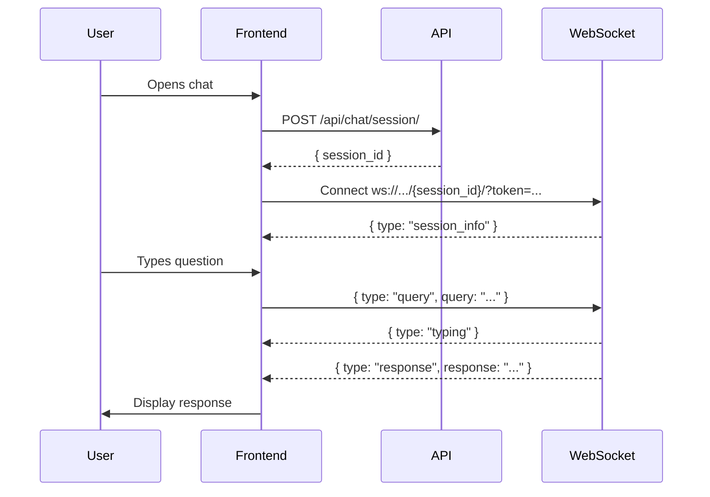
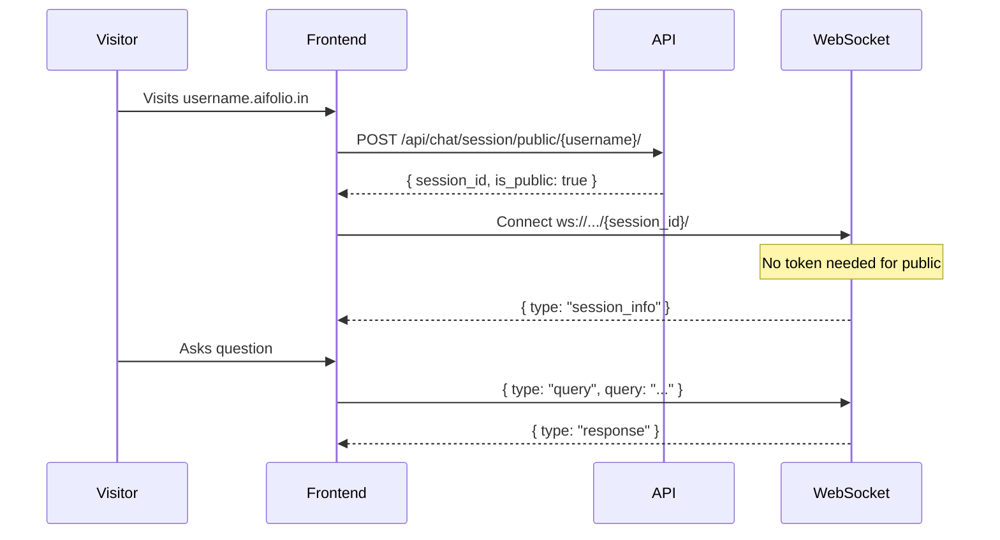

# AIFolio RAG Chatbot - Frontend Integration Guide

Complete API documentation for integrating the RAG chatbot into the AIFolio frontend.

---

## Overview

The chatbot provides two access modes:
1. **Dashboard Chat** - Authenticated users chatting with their own portfolio
2. **Public Chat** - Visitors chatting with a published portfolio

---

## Authentication

All authenticated endpoints require a JWT token in the `Authorization` header:
```
Authorization: Bearer <access_token>
```

---

## REST API Endpoints

### 1. Create Dashboard Session (Authenticated)

Creates a new chat session for the logged-in user.

```http
POST /api/chat/session/
Authorization: Bearer <jwt_token>
```

**Response (201):**
```json
{
  "session_id": "550e8400-e29b-41d4-a716-446655440000",
  "is_public": false,
  "created_at": "2025-12-31T12:00:00Z"
}
```

**Errors:**
- `401` - Not authenticated
- `404` - No portfolio found

---

### 2. Create Public Session (No Auth)

Creates a session for visitors on a published portfolio.

```http
POST /api/chat/session/public/{username}/
```

**Parameters:**
- `username` - The portfolio owner's username (from URL like `username.aifolio.in`)

**Response (201):**
```json
{
  "session_id": "550e8400-e29b-41d4-a716-446655440000",
  "is_public": true,
  "portfolio_owner": "John Doe",
  "created_at": "2025-12-31T12:00:00Z"
}
```

**Errors:**
- `404` - Portfolio not found
- `403` - Portfolio not published

---

### 3. Get Chat History

Retrieves paginated chat history for a session.

```http
GET /api/chat/history/{session_id}/?page=1&page_size=20
```

**Query Parameters:**
| Param | Type | Default | Max | Description |
|-------|------|---------|-----|-------------|
| `page` | int | 1 | - | Page number |
| `page_size` | int | 20 | 100 | Messages per page |

**Response (200):**
```json
{
  "session_id": "550e8400-e29b-41d4-a716-446655440000",
  "created_at": "2025-12-31T12:00:00Z",
  "last_activity": "2025-12-31T12:30:00Z",
  "messages": [
    {
      "id": 1,
      "role": "user",
      "content": "What are your skills?",
      "timestamp": "2025-12-31T12:05:00Z",
      "retrieved_documents": []
    },
    {
      "id": 2,
      "role": "assistant",
      "content": "I have expertise in Python, JavaScript...",
      "timestamp": "2025-12-31T12:05:02Z",
      "retrieved_documents": [1, 3, 5]
    }
  ],
  "pagination": {
    "page": 1,
    "page_size": 20,
    "total_messages": 10,
    "total_pages": 1,
    "has_next": false,
    "has_previous": false
  }
}
```

**Access Rules:**
- Public sessions: Anyone can access
- Private sessions: Only session owner (requires auth)

---

### 4. Delete Session (Authenticated)

Deletes a chat session and all its messages.

```http
DELETE /api/chat/session/{session_id}/
Authorization: Bearer <jwt_token>
```

**Response (200):**
```json
{
  "message": "Session deleted successfully",
  "session_id": "550e8400-e29b-41d4-a716-446655440000",
  "deleted_messages": 15
}
```

---

### 5. Get RAG Status (Authenticated)

Check if RAG documents are ready for the user.

```http
GET /api/chat/rag/status/
Authorization: Bearer <jwt_token>
```

**Response (200):**
```json
{
  "total_documents": 12,
  "sections": {
    "bio": 1,
    "experience": 3,
    "projects": 5,
    "skills": 1,
    "education": 2,
    "other": 0
  },
  "last_updated": "2025-12-31T10:00:00Z"
}
```

---

### 6. Trigger RAG Rebuild (Authenticated)

Manually rebuild RAG documents (useful after portfolio edits).

```http
POST /api/chat/rag/rebuild/
Authorization: Bearer <jwt_token>
```

**Response (202):**
```json
{
  "message": "RAG rebuild started",
  "task_id": "abc123-def456"
}
```

---

## WebSocket API

### Connection

```
ws://localhost:8000/ws/chat/{session_id}/?token={jwt_token}
```

**Parameters:**
- `session_id` - UUID from session creation
- `token` - JWT access token (optional for public sessions)

**Example (JavaScript):**
```javascript
const sessionId = '550e8400-e29b-41d4-a716-446655440000';
const token = localStorage.getItem('accessToken');

const ws = new WebSocket(
  `ws://localhost:8000/ws/chat/${sessionId}/?token=${token}`
);
```

---

### Connection Event

On successful connection, server sends:

```json
{
  "type": "session_info",
  "session_id": "550e8400-e29b-41d4-a716-446655440000",
  "is_public": false,
  "message": "Connected successfully",
  "history_loaded": 10
}
```

---

### Sending Messages

**Send a query:**
```json
{
  "type": "query",
  "query": "What projects have you worked on?",
  "top_k": 5,
  "section": null
}
```

| Field | Type | Required | Description |
|-------|------|----------|-------------|
| `type` | string | Yes | Must be `"query"` |
| `query` | string | Yes | User's question |
| `top_k` | int | No | Documents to retrieve (default: 5, max: 10) |
| `section` | string | No | Filter: `bio`, `experience`, `projects`, `skills`, `education` |

---

### Receiving Messages

**Typing indicator:**
```json
{
  "type": "typing",
  "message": "Thinking..."
}
```

**Response:**
```json
{
  "type": "response",
  "query": "What projects have you worked on?",
  "response": "I've worked on several projects including...",
  "sources": [
    {
      "id": 5,
      "section": "projects",
      "title": "AIFolio",
      "snippet": "AI-powered portfolio platform..."
    }
  ],
  "success": true,
  "timestamp": "2025-12-31T12:30:00Z"
}
```

**Error:**
```json
{
  "type": "error",
  "error": "Query is required"
}
```

---

### Keep-Alive

Send periodic pings to keep connection alive:

```json
{"type": "ping"}
```

Response:
```json
{"type": "pong"}
```

---

## React Integration Example

```tsx
import { useState, useEffect, useRef, useCallback } from 'react';

interface ChatMessage {
  role: 'user' | 'assistant';
  content: string;
  timestamp: string;
}

export function useChat(sessionId: string | null, token: string | null) {
  const [messages, setMessages] = useState<ChatMessage[]>([]);
  const [isConnected, setIsConnected] = useState(false);
  const [isTyping, setIsTyping] = useState(false);
  const wsRef = useRef<WebSocket | null>(null);

  useEffect(() => {
    if (!sessionId) return;

    const wsUrl = token
      ? `ws://localhost:8000/ws/chat/${sessionId}/?token=${token}`
      : `ws://localhost:8000/ws/chat/${sessionId}/`;

    const ws = new WebSocket(wsUrl);
    wsRef.current = ws;

    ws.onopen = () => setIsConnected(true);
    ws.onclose = () => setIsConnected(false);

    ws.onmessage = (event) => {
      const data = JSON.parse(event.data);

      switch (data.type) {
        case 'session_info':
          // Load history via REST if continuing session
          break;
        case 'typing':
          setIsTyping(true);
          break;
        case 'response':
          setIsTyping(false);
          setMessages(prev => [...prev, {
            role: 'assistant',
            content: data.response,
            timestamp: data.timestamp
          }]);
          break;
        case 'error':
          console.error('Chat error:', data.error);
          setIsTyping(false);
          break;
      }
    };

    return () => ws.close();
  }, [sessionId, token]);

  const sendMessage = useCallback((query: string) => {
    if (!wsRef.current || !isConnected) return;

    // Add user message immediately
    setMessages(prev => [...prev, {
      role: 'user',
      content: query,
      timestamp: new Date().toISOString()
    }]);

    wsRef.current.send(JSON.stringify({
      type: 'query',
      query
    }));
  }, [isConnected]);

  return { messages, isConnected, isTyping, sendMessage };
}
```

---

## Dashboard Flow



---

## Public Portfolio Flow



---

## Error Handling

| Code | Meaning | Action |
|------|---------|--------|
| 401 | Not authenticated | Redirect to login |
| 403 | Access denied | Show error message |
| 404 | Not found | Show "Portfolio not found" |
| 500 | Server error | Show retry option |

**WebSocket Reconnection:**
```javascript
ws.onclose = (event) => {
  if (event.code !== 1000) {
    // Abnormal close, attempt reconnect
    setTimeout(() => reconnect(), 3000);
  }
};
```

---

## Session Persistence

Store `session_id` in localStorage to continue conversations:

```javascript
// On session creation
localStorage.setItem(`chat_session_${portfolioId}`, sessionId);

// On page load
const existingSession = localStorage.getItem(`chat_session_${portfolioId}`);
if (existingSession) {
  // Verify session is still valid, then connect
}
```

---

## Production Considerations

1. **WebSocket URL**: Update to `wss://` for production
2. **CORS**: Backend allows `*.aifolio.in` subdomains
3. **Rate Limiting**: Consider implementing on frontend
4. **Token Refresh**: Handle token expiry mid-session
